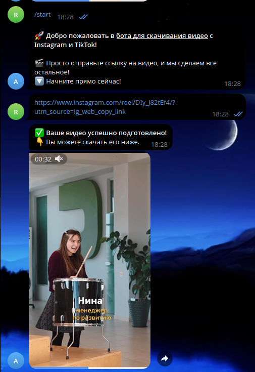
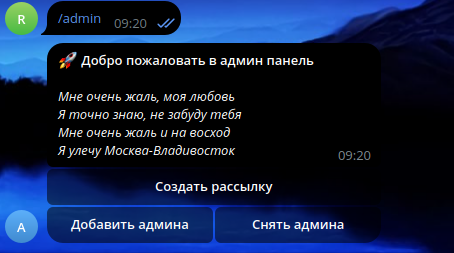
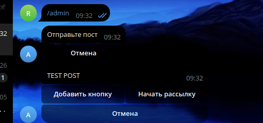

# TikTok Downloader Bot

Этот бот позволяет пользователям скачивать видео с TikTok и Instagram в формате MP4 всего за несколько кликов!

## Описание

Пользователи могут отправить ссылку на видео из TikTok или Instagram, и бот отправит им готовый файл в формате MP4. Простота и удобство — основные принципы работы этого бота.

### Функции:
- **Скачивание видео**: Отправьте ссылку на видео из TikTok или Instagram, и получите готовое видео в формате MP4.
- **Админ панель**:
  - **Рассылка**: Возможность отправлять сообщения всем пользователям.
  - **Управление админами**: Легкость в добавлении/удалении администраторов.
  - **Проверка подписки**: Бот проверяет, подписан ли пользователь на Telegram-канал.

## Скриншоты

### Использование бота со стороны клиента

Пользователь отправляет ссылку на видео и получает готовый файл:



### Админ панель





## Установка

1. Клонируйте репозиторий:
    ```bash
    git clone https://github.com/reques6e/tiktok-downloader.git
    ```

2. Установите зависимости:
    ```bash
    pip install -r requirements.txt
    ```

3. Запустите бота:
    ```bash
    python main.py
    ```

## Конфигурация

Для настройки бота используйте файл `.env`, в котором укажите ключи API, токены и другие параметры.

## Контакты

- GitHub: [https://github.com/reques6e](https://github.com/reques6e)
- Поддержка: [Напишите нам](https://t.me/rqs6e)

## Лицензия

Этот проект лицензируется под MIT License — подробности см. в файле [LICENSE](LICENSE).
